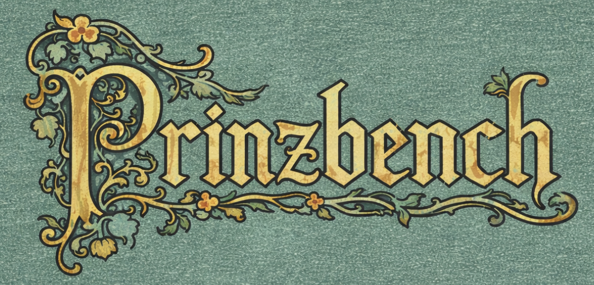

# prinzbench[^1]
prinzbench is a private benchmark that ranks LLMs based on their ability to conduct legal research and analysis ("legal reasoning") and locate obscure publicly available information online ("needle-in-the-haystack search").

The current leaderboard is set forth immediately below, followed by notes on methodology, grading, model access and specific models' performance.

<!-- LEADERBOARD_START -->
Last updated on April 24, 2026

| Model                       | prinzbench (full) score (x/99) | Legal Research Sub-Score (x/75) | Search Sub-Score (x/24) |
| --------------------------- | -----------------------------: | ------------------------------: | ----------------------: |
| gpt-5.5-pro (extended)*     |                             82 |                              63 |                      19 |
| gpt-5.4-pro (extended)      |                             79 |                              59 |                      20 |
| gpt-5.5-thinking (heavy)*   |                             74 |                              56 |                      18 |
| gpt-5.4 (xhigh)             |                             69 |                              50 |                      19 |
| gpt-5.4-thinking (heavy)    |                             68 |                              49 |                      19 |
| gpt-5.4-thinking (extended) |                             58 |                              43 |                      15 |
| gpt-5.2-thinking (extended) |                             52 |                              41 |                      11 |
| gpt-5.3-codex-high          |                             52 |                              41 |                      11 |
| gemini-3.1-pro              |                             50 |                              41 |                       9 |
| grok-4.20                   |                             43 |                              34 |                       9 |
| gemini-3-flash              |                             36 |                              29 |                       7 |
| gemini-3-pro                |                             35 |                              29 |                       6 |
| kimi-k2.5-thinking          |                             35 |                              28 |                       7 |
| meta-muse-spark             |                             31 |                              24 |                       7 |
| grok-4.1-thinking           |                             25 |                              19 |                       6 |
| qwen-q3-max                 |                             25 |                              18 |                       7 |
| opus-4.7                    |                             25 |                              21 |                       4 |
| grok-4                      |                             23 |                              16 |                       7 |
| kimi-k2-thinking            |                             22 |                              18 |                       4 |
| sonnet-4.5                  |                             20 |                              20 |                       0 |
| opus-4.6                    |                             19 |                              18 |                       1 |
| opus-4.5                    |                             14 |                              14 |                       0 |
| sonnet-4.6                  |                              8 |                               8 |                       0 |
~* denotes a model accessed in early testing, before public release.
<!-- LEADERBOARD_END -->
## Purpose
Why this benchmark was created:
1. There has recently been much interest in benchmarks that measure LLMs' ability to perform economically valuable work.  The subject of *prinzbench* - legal research - is economically valuable work.
2. Many existing LLM benchmarks focus on subjects like math and coding, and there has recently been a sharp increase in LLMs' performance on these benchmarks.  However, some skeptics have declared that existing LLMs are great at math and coding only because the frontier labs overfit the models for these specific tasks, "hill-climbing the benchmarks" even as AI models' ability to help with other real-world tasks has remained limited.  *prinzbench* proves these skeptics wrong by showing that certain existing LLMs possess surprisingly strong ability to correctly research and analyze statutes, regulations and regulatory guidance in a particular niche area of U.S. law.[^2] 
## Methodology
*prinzbench* is intended to test AI models' ability to: (i) find legal authorities or factual information that are relevant to answering a legal research question; and (ii) properly analyze available legal authorities to reach the correct conclusion.  To that end, *prinzbench* comprises:
* 25 **Legal Research** questions, each of which presents the LLM with a fact pattern that must be correctly analyzed based on applicable U.S. laws
* 8 **Search** questions, each of which asks the LLM to find an obscure piece of information that is publicly available online

All 33 questions were drafted by the author, and have never been - nor will they ever be - shared with any other person.  

The **Legal Research** questions all relate to a particular niche area of U.S. law in which the author is an expert.  To answer these questions correctly, the LLM is required to locate the relevant statutes, regulations and/or regulatory guidance - all of which are publicly available online.  The answer to each Legal Research question can be found by examining only a few applicable legal authorities; there is never any need for the LLM to trawl through hundreds of cases and juxtapose their holdings in order to arrive at the correct response.  Certain Legal Research questions also require the LLM to locate obscure publicly available factual information to reach the correct conclusion.  

The **Search** questions were added to *prinzbench* to strengthen the benchmark's ability to test LLMs for "needle-in-the-haystack" search capabilities.  These questions are not necessarily related to the practice of law.  

All questions included in *prinzbench* are considered by the author to be very difficult: generally of the kind that, in the author's judgment, an average junior associate practicing in the relevant area of the law would likely not be able answer correctly if provided no research direction beyond the prompt provided to the LLM.  In compiling *prinzbench*, the author endeavored to include therein only truly challenging questions, and each candidate question was tested on an ad-hoc basis with various LLMs before a decision was made regarding its inclusion in the benchmark.  Well over 100 candidate questions were rejected through this process, as the LLMs - frustratingly for the author - had found them "too easy".

To arrive at each model's *prinzbench* (full) score, the model was asked each of the 33 questions exactly three (3) times.  Each response was graded at pass@1.  The maximum *prinzbench* (full) score is 99 points (*i.e.,* 33 questions * 3).  

In addition to each model's *prinzbench* (full) score, the leaderboard also presents each model's Legal Research sub-score (maximum 75 points) and Search sub-score (maximum 24 points), for informational purposes.
## Grading
Each LLM's response to each question was personally graded by the author, unaided by AI. The author graded each output with full knowledge of which model had produced the output (i.e., grading was not "blind").

Some technical details regarding grading:
* A response was judged to be correct if the correct legal conclusion was present anywhere within the model's response.  For example, suppose the correct answer to a particular question is: "You must aggregate the impact of not fewer than 1,000 different transactions of the same type in order to violate a law; because it's unlikely that there would ever be 1,000 such transactions within the specified time frame, it is almost certain that the law was not violated."  If this exact reasoning was included in the body of the model's response, but the model's concluding paragraph simply said that the law was not violated, the response was marked as correct.
* LLMs have a tendency to include extraneous information in their responses, which is not directly relevant to answering the question.  In grading LLMs' responses, all such extraneous information was ignored - regardless of whether it was factually accurate or legally correct.  In other words, the models were graded on their ability to answer the specific question, not on the accuracy of the entirety of the response.

## Model Performance Specifics; Model Access
### OpenAI
#### GPT-5.5
In April 2026, **gpt-5.5-Pro (Extended)** set a new record on *prinzbench*, scoring 82/99 overall (3 points higher than **gpt-5.4-Pro (Extended)**).  The model performed significantly better than **gpt-5.4-Pro (Extended)** in Legal Research (63/75 vs. 59/75), but slightly worse in Search (19/24 vs. 20/24).

Putting the Pro models (which involve parallelized compute; see the note below) to the side, **gpt-5.5-Thinking (Heavy)**, likewise tested in April 2026, is the best-performing model on *prinzbench*, having scored 74/99 overall.  This model performed significantly better (*i.e.*, 5 points higher) than the next-best non-Pro model, **gpt-5.4 (xhigh)**.  The model performed significantly better than **gpt-5.4 (xhigh)** in Legal Research (56/75 vs. 50/75), but slightly worse in Search (18/24 vs. 19/24).

These results indicate to the author that the **gpt-5.5** models are better reasoners than the **gpt-5.4** models, but have slightly worse search capabilities (potentially because they produce significantly faster results - including, presumably, by spending less time searching).

As stated by the author [elsewhere](https://x.com/deredleritt3r/status/2047395657405940054), **gpt-5.5-Pro (Extended)** took significantly less time to respond per question than **gpt-5.4-Pro (Extended)** (≈8 minutes vs. ≈30 minutes per question).  Similarly, **gpt-5.5-Thinking (Heavy)** took significantly less time to respond per question than the **gpt-5.4-Thinking** models (≈2 minutes vs. ≈8 minutes per question).  This is a significant improvement in speed, which should make the **gpt-5.5** models even more useful in legal work.

**While the scores achieved by gpt-5.5-Pro and gpt-5.4-Pro on *prinzbench* are impressive, the author cautions against directly comparing them to scores achieved by the other models tested to date, since the Pro models are extremely heavy reasoning models that use parallel test-time compute and consequently typically expend significantly more compute than these other models.**[^3]
#### Earlier Models
At the benchmark's creation in January 2026, **gpt-5.2-Thinking** achieved the highest score on *prinzbench* by a large margin (52/99, as compared to the next-best model's 36/99).  The model also achieved by far the best Legal Research and Search sub-scores (41/75 and 11/24, respectively).

In February 2026, **gpt-5.3-Codex-high** matched the high score previously achieved by **gpt-5.2-Thinking***.  While the scores and sub-scores achieved by the two models were, in the end, identical, the author found them to have different strengths and weaknesses.  For example, **gpt-5.3-Codex-high** scored 3/3 on one particular question that had never been solved correctly by any other model, including **gpt-5.2-Thinking***.

In March 2026, **gpt-5.4-Thinking** achieved better scores than **gpt-5.2-Thinking** across the board.  Specifically, **gpt-5.4-Thinking (Extended)** scored 6 points higher on *prinzbench* than **gpt-5.2-Thinking (Extended)** (58/99 vs. 52/99), while **gpt-5.4 (xhigh)** achieved the then-best result for a non-Pro model (69/99).  In addition, **gpt-5.4-Pro (Extended)** achieved an overall score of 79/99 on *prinzbench* - which was the best performance by any model on the benchmark through that date.  In particular, the **gpt-5.4** models performed remarkably well on the Search component of *prinzbench* (20/24 for **gpt-5.4-Pro (Extended)** and 19/24 for each of **gpt-5.4-Thinking (Heavy)** and **gpt-5.4 (xhigh)**).
#### Model Access:
**gpt-5.2-Thinking** and **gpt-5.4-Thinking** ("Extended Thinking") were accessed from the author's personal ChatGPT Plus account in January 2026 and March 2026, respectively.  The **gpt-5.5** models and the **gpt-5.4** models (in each case, using the "Extended" reasoning effort for the Pro models and the "Heavy" reasoning effort for the Thinking models) were accessed from the author's personal ChatGPT Pro account in April 2026 and March 2026, respectively.  Each chat was a temporary chat in order to disable ChatGPT's Memory and custom instructions features.  **gpt-5.3-Codex-high** and **gpt-5.4-Thinking-xhigh** were accessed by the author through the terminal, with his personal ChatGPT Plus/Pro accounts connected, in February 2026 and March 2026, respectively.

The author had early access to **gpt-5.5-Pro** and **gpt-5.5-Thinking**; see footnote 1 for more details.
### Google 
At the benchmark's creation in January 2026, **gemini-3-flash** and **gemini-3-pro** achieved the second and third place, respectively, on *prinzbench*, bested only by **gpt-5.2-Thinking**.  The two models' scores were nearly identical (36/99 and 35/99, respectively).  The models exhibited especially strong Legal Research capabilities, bested only by **gpt-5.2-Thinking**, and far stronger than those of the tested Anthropic, xAI and Moonshot models.  

**gemini-3.1-pro**, benchmarked in February 2026, nearly matched OpenAI's models (**gpt-5.2-Thinking** and **gpt-5.3-Codex-high**) in performance (50/99 vs. 52/99 for each of the OpenAI models).  The author views the *prinzbench* scores achieved by these three models as roughly identical.
#### Model Access:
**gemini-3-flash** and **gemini-3-pro** were both accessed, in January 2026, via AI Studio, with the following settings: Temperature: 1; Thinking Level: High; Grounding with Google Search: On.  **gemini-3-pro** was accessed via AI Studio using the same settings in February 2026.

### Anthropic
#### Opus 4.7
In April 2026, **opus-4.7** achieved the best score by an Anthropic model on *prinzbench* to date, scoring 25/99 (as compared to 20/99 achieved by **sonnet-4.5** and 19/99 achieved by **opus-4.6**).  The model's Legal Research score was comparable to that of **sonnet-4.5** (21/75 vs. 20/75), while its Search score (4/24) was significantly higher than that achieved by any other Anthropic model to date (**opus-4.6** scored 1/24; all other Anthropic models tested to date scored 0/24).

The reason for the gap in performance between Anthropic's models and many models released by various other labs that have been tested on *prinzbench* to date remains unclear.  The author continues to suspect that Anthropic's models would score somewhat higher on the benchmark if they had better search capabilities.
#### Earlier Models
At the benchmark's creation in January 2026, **opus-4.5** and **sonnet-4.5** achieved the worst two scores on *prinzbench* out of the eight total AI models tested (14/99 and 20/99, respectively).  To the author's surprise, **sonnet-4.5** achieved a higher score on *prinzbench* than **opus-4.5** (20/99 vs. 14/99).  This difference is fairly significant, and, in the author's view, is likely explained by **sonnet-4.5** being the (slightly) better legal reasoner out of the two models - a counterintuitive result.  

**opus-4.6**, released in February 2026, achieved a similar performance on *prinzbench* to Anthropic's previously tested models (19/99, one point lower than **sonnet-4.5**).  **sonnet-4.6**, also released in February 2026, achieved the worst performance on *prinzbench* out of all models benchmarked through that date (8/99).  
#### Model Access:
**opus-4.5** and **sonnet-4.5** were both accessed from the author's personal Claude Pro account, with "Extended Thinking" turned on, in January 2026.  **opus-4.6** and **sonnet-4.6** were accessed from the author's personal Claude Pro account, with "Extended Thinking" turned on, in February 2026.  **opus-4.7** was accessed from the author's personal Claude Pro account, with "Extended Thinking" turned on, in April 2026.  Each chat was a temporary chat in order to disable Claude's Memory and custom instructions features.

### xAI
At the benchmark's creation in January 2026, **grok-4.1-Thinking** and **grok-4** achieved unspectacular scores on *prinzbench* of 25/99 and 23/99 respectively.  The models performed as well as the Google models on the Search sub-score (6/24 and 7/24, respectively - which were the same results as those achieved by **gemini-3-flash** and **gemini-3-pro**), but significantly underperformed the Google models on the Legal Research sub-score.

In February 2026, **grok-4.20** achieved the fourth-highest score on *prinzbench* (43/99).  This model appears to take the "best of" the results independently achieved by four different agents, which makes it structurally different from all other models benchmarked through February 2026.  This makes it difficult to directly compare the underlying model's performance to the respective results of all other benchmarked models.[^4]    l
#### Model Access:
**grok-4.1-Thinking** and **grok-4** were both accessed from the author's personal SuperGrok account in January 2026, and **grok.4.20** was accessed in the same fashion in February 2026.  Each chat was a temporary chat in order to disable Memory and custom instructions features.

### Moonshot AI
On January 28, 2026, **kimi-K2.5-Thinking** achieved an impressive score of 35/99 on *prinzbench*, tying the second-place scores previously achieved by the Gemini 3 models.   

At the benchmark's creation in January 2026, **kimi-K2-Thinking** achieved an unspectacular score of 22/99 on *prinzbench*.  The model's performance was similar to the performance of the xAI models, although it slightly lagged them in the Search sub-score (4/24 vs. 7/24 and 6/24 for **grok-4** and **grok-4.1-Thinking**, respectively).
#### Model Access:
**kimi-K2.5-Thinking** and **kimi-K2-Thinking** were accessed via kimi.com (logged in) in January 2026.

### Alibaba Cloud
In January 2026, **qwen3-max** achieved an unspectacular score of 25/99 on *prinzbench*, tying with **grok-4.1-Thinking**.  The model performed significantly worse than **kimi-K2.5-Thinking**, which was released by Moonshot AI on the same day.
#### Model Access:
**qwen3-max** was accessed via chat.qwen.ai (logged in) in January 2026.

### Meta
In April 2026, **meta-muse-spark** achieved an unspectacular score of 31/99 on *prinzbench*, several points lower than **gemini-3-pro** and significantly lower than those achieved by various models subsequently released by OpenAI and Google.  The model's Search score (7/24) was comparable to Search scores achieved by various models released in late 2025/early 2026 (such as **gemini-3-pro** and **kimi-k2-thinking**).
#### Model Access:
**meta-muse-spark** was accessed via meta.ai (logged in) in April 2026.

[^1]: Starting in April 2026, the author has, on occasion, been provided early tester access to certain OpenAI models - including, as relevant to this benchmark, **gpt-5.5-Pro** and **gpt-5.5-Thinking**.  The author has not accepted, and does not intend to accept, any compensation from OpenAI or any other lab for producing this benchmark.  Neither OpenAI nor any other lab has been provided access to any questions in *prinzbench*, nor to any similar questions that could help such lab train its models to have a higher success rate on *prinzbench*.

[^2]: This particular niche area of U.S. law is not well-represented in existing LLMs' training data, as shown by the fairly poor *prinzbench* scores achieved by several frontier models, including Anthropic's Opus 4.5 and Sonnet 4.5, as well as models released by Moonshot and xAI.  

[^3]: For example, on [ARC-AGI-2](https://arcprize.org/leaderboard), **gpt-5.4-Pro** cost $16.41 to run per task - significantly higher than the cost to run the other models tested on *prinzbench* to date.  In comparison, **gemini-3.1-pro** cost $0.962 per task, while **gpt-5.4 (xhigh)** cost $1.52 per task.

[^4]: As one point of comparison, taking the "best of three results" approach for **gemini-3.1-pro** would yield a score of 63/99 on *prinzbench*; a "best of four results" approach would possibly yield an even higher score.